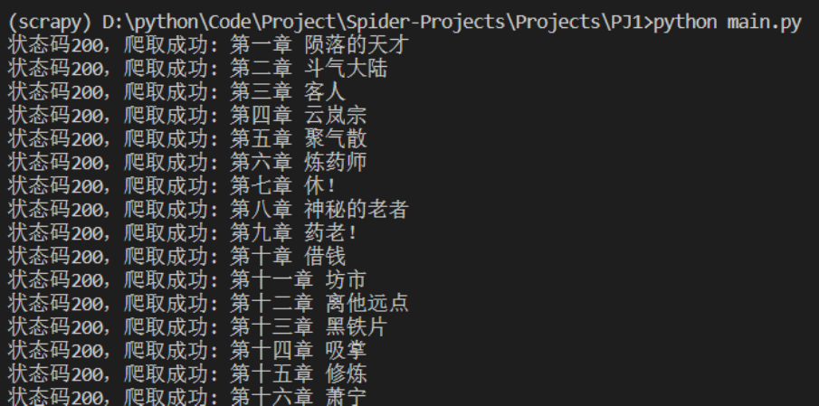
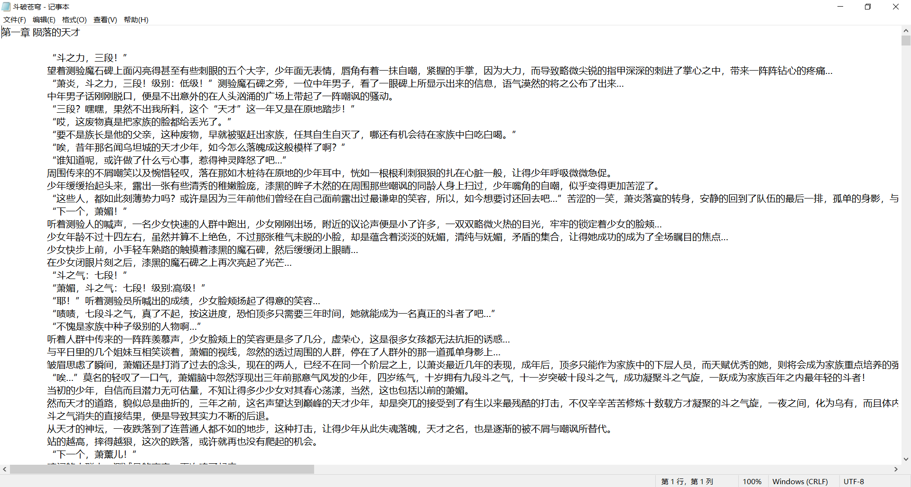
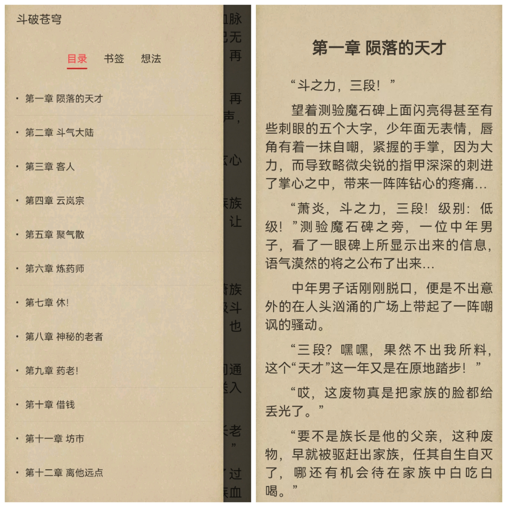

# Project 1 - 指定小说爬取

以小说《斗破苍穹》为例，从笔下文学网爬取指定小说的全部章节，并将其保存为txt文件（方便导入移动端小说阅读器阅读）。

- 目标网站：[斗破苍穹全文阅读（笔下文学）](https://www.bxwx7.org/article/6692/)

## 相关技术

- 使用`requests`库发送http请求
- 使用`re`库进行正则表达式匹配

## 运行项目

切换到项目所在目录下，在命令行中执行以下指令：

```shell
python main.py
```

你将看到如下结果：



## 运行结果

等待爬虫爬取完毕后，可打开`斗破苍穹.txt`文件查看爬取结果：



将小说导入手机阅读软件：


## 问题

1. 爬取速度太慢。一秒钟只能爬大概1-2个章节。爬取整本小说可能需要数十分钟。