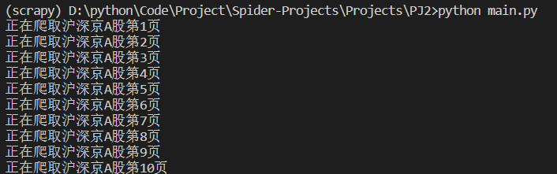
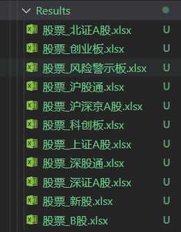
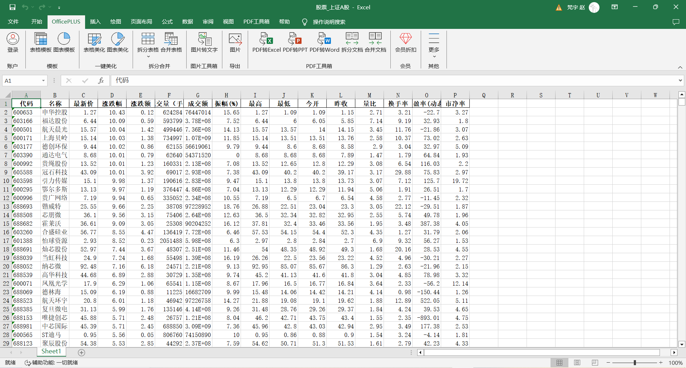

# Project 2 - 股票爬取

从东方财富网爬取股票信息。

- 目标网站：[东方财富网](https://www.eastmoney.com/)
- 直接从目标网站**数据接口**爬取数据

## 相关技术

- 使用`requests`库发送http请求
- 使用`re`库进行正则表达式匹配

## 运行项目

切换到项目所在目录下，在命令行中执行以下指令：

```shell
python main.py
```

你将看到如下结果：



## 运行结果

等待爬虫爬取完毕后，可在`Resultes`文件夹下查看爬取结果：



打开`股票_上证A股.xlsx`，结果如下：


## 问题

1. 直接从接口请求数据而非从页面提取，普适性不高。